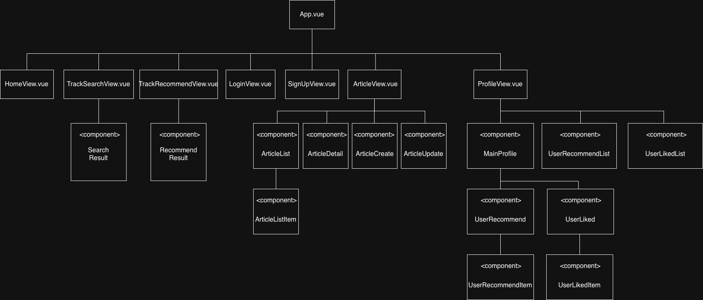

# 🚀 12/12 관통프로젝트 11

## 📝 프로젝트 진행 내용

- **UML 다이어그램 작성**
  - 컴포넌트 간의 세부 사항 정리

## 👨‍💻 어려웠던 부분

- `state`의 관리를 고려하여 페이지를 구성하는 것이 복잡하고 어려웠습니다
- 개발하기 전에 필요한 `component`를 구성하고 부모, 자식 관계 `props`를 설정하는 과정이 어려웠습니다

## ✨ 새로 배운 것

- `UML`을 만들어 보니 전체적인 흐름을 한 눈에 알 수 있어서 좋았습니다
- `draw.io`를 통해 다이어그램을 쉽게 제작 가능하다는 것을 알게 되었습니다

## 💡 느낀점

- 간단하게 만든다고 생각했는데 생각보다 많은 `component`들이 필요하다는 알게되었습니다
- 설계한 대로 개발이 진행되지는 않겠지만 기획서를 작성하거나 다이어그램을 만드는 것이 개발의 방향성을 정할 수 있고 개발 시간을 단축시킬 수 있다고 느꼈습니다